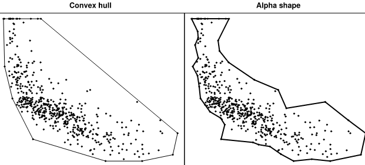

# fast-alphashape

[](https://pypi.org/project/fast-alphashape/)
[](https://github.com/mblackgeo/fast-alphashape/actions)
[](https://github.com/mblackgeo/fast-alphashape/actions)
[](https://github.com/psf/black)

A Rust backed implementation for generating 2D [alpha shapes](https://en.wikipedia.org/wiki/Alpha_shape) from points.

**This project is still a prototype and should not be considered production-ready.**



Alpha shapes are often used to generalise bounding polygons containing sets of points. The alpha parameter is defined as the value `a`, such that an edge of a disk of radius `1/a` can be drawn between any two edge members of a set of points and still contain all the points. The [convex hull](https://en.wikipedia.org/wiki/Convex_hull), a shape resembling what you would see if you wrapped a rubber band around pegs at all the data points, is an alpha shape where the alpha parameter is equal to zero.


## Installation

```shell
pip install fast-alphashape
```


## Quick start

The package provides an `alphashape` function that takes a 2D array of points and an alpha value:

```python
import numpy as np
from fast_alphashape import alphashape

points = np.array(
    [
        (0.0, 0.0),
        (0.0, 1.0),
        (1.0, 1.0),
        (1.0, 0.0),
        (0.5, 0.25),
        (0.5, 0.75),
        (0.25, 0.5),
        (0.75, 0.5),
    ]
)

alpha_polygon = alphashape(points, alpha=2.0)
```


## Development

Prequisites:

* Python (>=3.7) and make
* [Rust toolchain](https://rustup.rs/)

After cloning the repository, the Makefile includes helpful commands for setting up a development environment, linting, formatting, testing, and benchmarking. Get started as follows:

```shell
# setup a new virtual environment
python -m venv .venv
source .venv/bin/activate

# install the development dependencies
make install

# check other available commands
make help
```

Tooling:

* Cargo and [Pytest](https://docs.pytest.org/en/6.2.x/) are used for testing the Rust and Python code respectively (see [`/tests`](/tests/)).
* Python code is linted using [flake8](https://flake8.pycqa.org/en/latest/) and formatted using [Black](https://github.com/psf/black); rust code with `cargo fmt` and `cargo clippy`.
* [pre-commit](https://pre-commit.com/) is used to run these checks locally before files are pushed to git
* The [Github Actions pipeline](.github/workflows/ci.yml) runs these checks and tests
* [Semantic-release](https://python-semantic-release.readthedocs.io/en/latest/) is used with [conventional commits](https://www.conventionalcommits.org/en/v1.0.0/) for automated releasing to PyPI


## Credits

* This project is largely a Rust port of the [Alpha Shape Toolbox](https://github.com/bellockk/alphashape) by Ken Bellock
* Image credit: Sigbert, [CC BY-SA 3.0](https://creativecommons.org/licenses/by-sa/3.0), via [Wikimedia Commons](https://commons.wikimedia.org/wiki/File:ScagnosticsBase.svg)